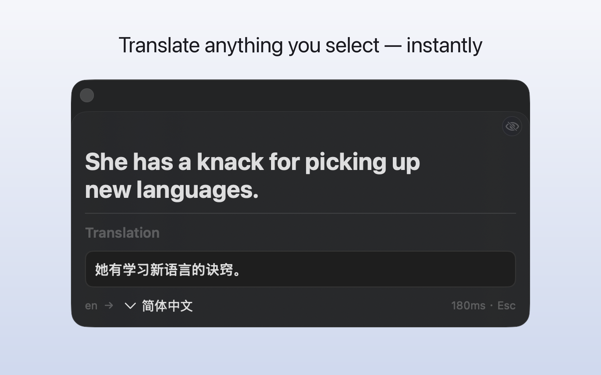
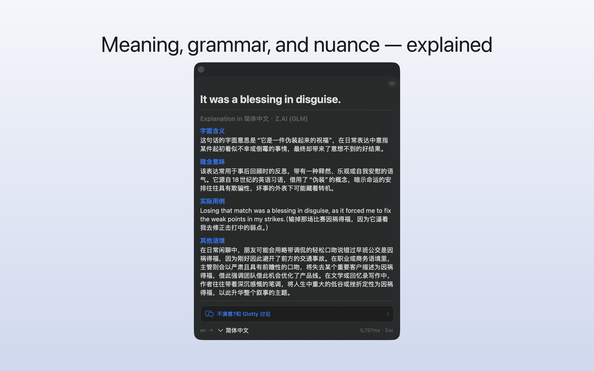
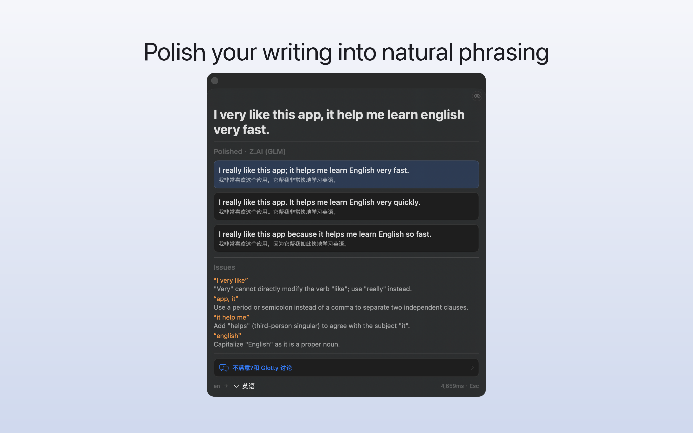
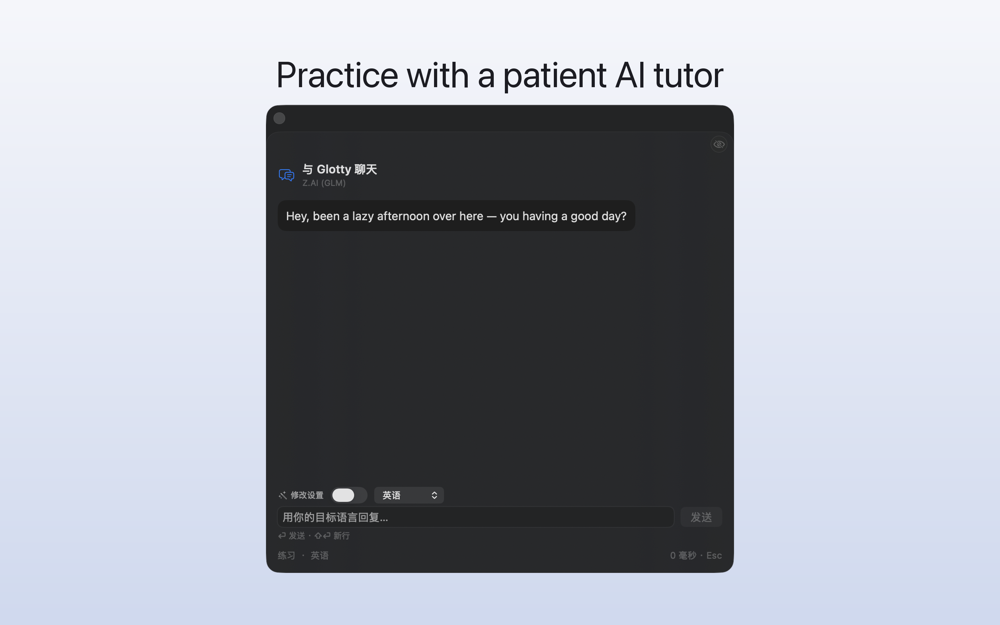
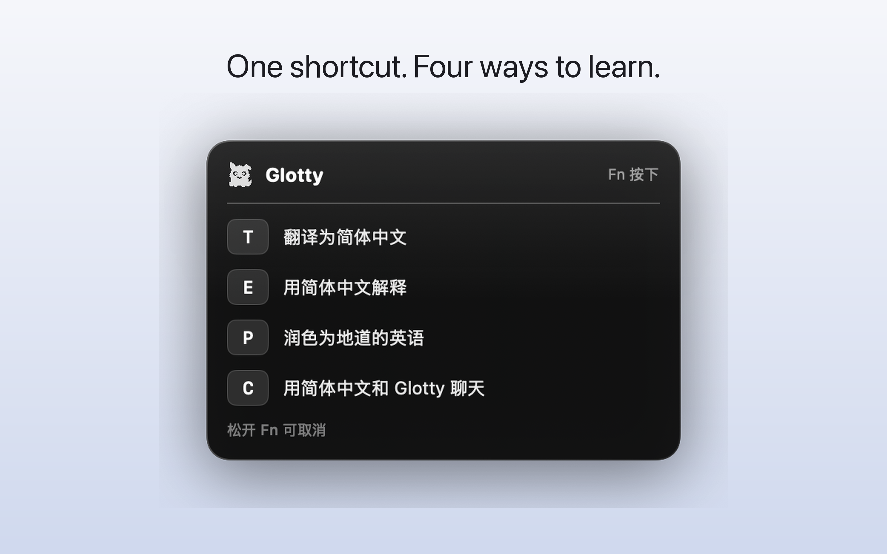

<div align="center">
  
  <h1>Glotty</h1>
  <p>
    <b>Translate</b>, <b>explain</b>, <b>polish</b>, <b>chat</b>, and <b>speak</b> any text —
    <br>right where you're reading or writing.
  </p>
  <p>
    
    
    
  </p>
  <p>
    <b>English</b> ·
    <a href="README.zh-CN.md">简体中文</a>
  </p>
</div>

**Glotty** is a macOS menu-bar app for reading and writing in a foreign language. Select
text in *any* app — or open a book in the built-in reader — and translate it, get a
plain-language explanation, polish your own draft into natural phrasing, chat with a tutor
about it, or hear it read aloud. It's built for learners who want a fast, in-place tutor
instead of a separate translation window: no app-switching, no copy-paste.

> A personal project, shared as-is under the GPL. Expect rough edges.

## ✨ Highlights

- 🌐 **Translate** — Apple's on-device Translation + macOS system dictionaries, with an optional LLM gloss.
- 💡 **Explain** — a plain-language explanation in your native language: nuance, usage, and context.
- ✏️ **Polish** — rewrite your own draft into more idiomatic target-language phrasing.
- 💬 **Chat** — a follow-up tutor conversation about the word, sentence, or your writing.
- 🔊 **Speak** — text-to-speech via the built-in macOS voice, or ElevenLabs.
- 📖 **Reader** — a built-in EPUB / PDF reader: tap any word to look it up, and mark the vocabulary you want to remember (it stays underlined). Also registers as an *Open With* handler for `.epub` / `.pdf`.
- 🧠 **Memory** — optionally learns durable glossary terms, preferences, and background facts from your chats to personalize later answers.
- 🔑 **Bring your own LLM** — keys stay in the macOS **Keychain**, never in the app's files.
- 🌍 **Localized** across several languages.

## 📸 Screenshots

|  Translate  |  Explain  |
| :---------: | :-------: |
|  |  |
|  **Polish**  |  **Chat**  |
|  |  |

## ⌨️ How to trigger it

Two ways, both working across every app:

- **Leader hotkey** — hold the leader key (`Fn` by default), then tap a letter: `T` translate, `E` explain, `P` polish, `C` chat, `V` speak, `R` correct spelling. A heads-up menu shows the choices while you hold.
- **Hover menu** — rest the pointer on a selection and a compact bar pops up with the same actions.

<div align="center">
  
</div>

## 🧩 Providers

Bring your own key for a hosted LLM, or run fully on-device:

- **Hosted** — OpenAI, DeepSeek, and other OpenAI-compatible endpoints.
- **On-device** — Apple Intelligence (Foundation Models), plus Apple's Translation framework and system dictionaries for lookups that need no network at all.

## 🛠 Build & run

Requirements: **macOS 15+**, **Xcode 16+**, and [XcodeGen](https://github.com/yonaskolb/XcodeGen) (`brew install xcodegen`) — the `.xcodeproj` is generated, not checked in.

```sh
xcodegen generate     # produce Glotty.xcodeproj from project.yml
open Glotty.xcodeproj  # then Run in Xcode
```

Or an unsigned build from the command line:

```sh
xcodegen generate
xcodebuild -project Glotty.xcodeproj -scheme Glotty -configuration Debug \
  -destination 'platform=macOS' CODE_SIGNING_ALLOWED=NO build
```

For a **signed** build, add your Apple Developer identity — `project.yml` ships with an empty `DEVELOPMENT_TEAM`; set yours (and adjust `CODE_SIGN_*`) or override on the `xcodebuild` command line.

## ⚙️ Configuration & permissions

- Add an LLM provider + API key in **Settings → Language Model** (stored in Keychain); an optional ElevenLabs voice key lives in **Settings → Voice**.
- Glotty is a menu-bar agent (no Dock icon). Reading the selection in other apps needs **Accessibility**; the leader hotkey needs **Input Monitoring**; proactive reminders need **Notifications** — grant these when prompted, or from the in-app **Permissions** pane.

## 🌍 Localization

UI strings live in `Glotty/Resources/Localizable.xcstrings`. `scripts/extract-strings.sh` scans the source for translatable literals, and `scripts/translate-catalog.py` fills the catalog across languages (using an LLM key of your own).

## 📄 License

[GPL-3.0](LICENSE).
