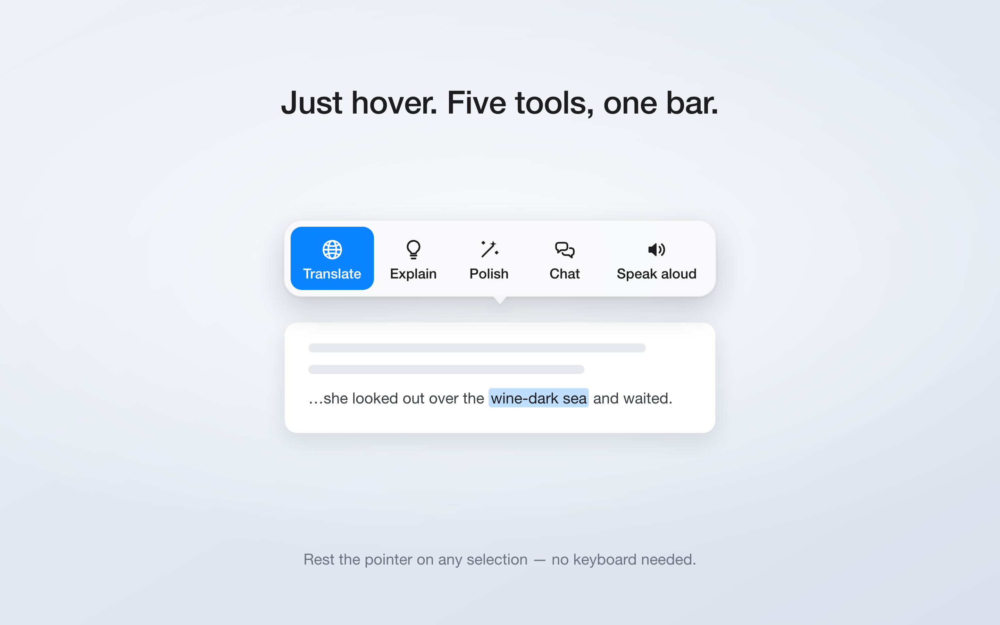
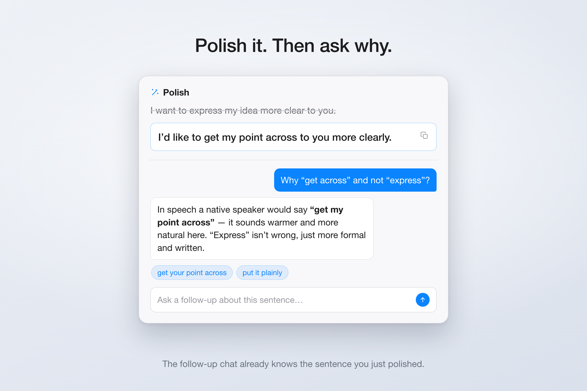
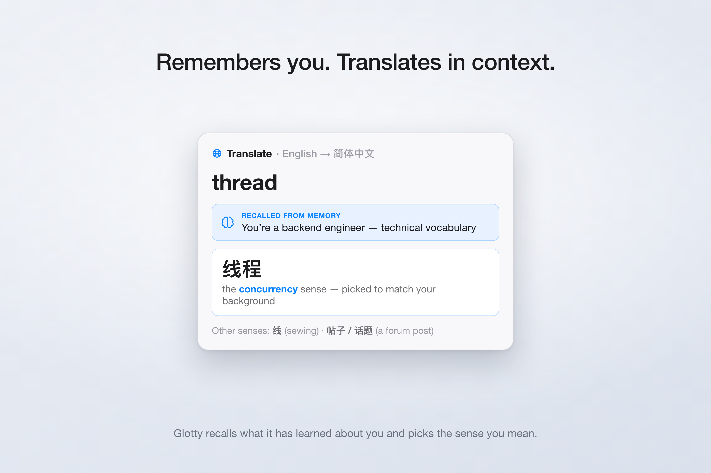

  
  <h1>Glotty</h1>
  

    <b>翻譯</b>、<b>解釋</b>、<b>潤色</b>、<b>對話</b>、<b>朗讀</b>任意文字 ——
     就在你閱讀或寫作的地方。
  

  

    
    
    
  

  

    <a href="../README.md">English</a> ·
    <a href="README.zh-CN.md">简体中文</a> ·
    <b>繁體中文</b> ·
    <a href="README.ja.md">日本語</a> ·
    <a href="README.ko.md">한국어</a>
  

**Glotty** 是一款用於外語閱讀與寫作的 macOS 選單列 App。在*任意* App 中選取文字 ——
或在內建閱讀器中打開一本書 —— 即可翻譯它、獲得淺顯易懂的解釋、把你的草稿潤飾為道地表達、
就它展開對話，或朗讀出來。它為想要即時、就地的語言輔導（而非另開一個翻譯視窗）的學習者而生：
無需切換 App，無需複製貼上。

## ✨ 亮點

- 🌐 **翻譯** —— Apple 的裝置端翻譯 + macOS 系統辭典，並可選 LLM 釋義。
- 💡 **解釋** —— 用你的母語給出淺顯解釋：語感、用法與語境。
- ✏️ **潤色** —— 把你自己的草稿改寫為更道地的目標語言表達。
- 💬 **對話** —— 就某個詞、句子或你的寫作展開輔導式追問。
- 🔊 **朗讀** —— 透過 macOS 內建語音或 ElevenLabs 進行文字轉語音。
- 🧠 **記憶** —— 可選地從你的對話中學習長期有用的術語、偏好與背景資訊，用於個人化後續回答。
- 🔗 **理解上下文** —— 在各步驟間保留上下文：一次潤色可延續為追問對話，翻譯也會參考它記住的關於你的資訊。
- 🔑 **自帶 LLM** —— 金鑰保存在 macOS **鑰匙圈**中，絕不寫入 App 檔案。
- 🌍 介面**多語言**支援。

## 📸 螢幕截圖

|  翻譯  |  解釋  |
| :--: | :--: |
|  |  |
|  **潤色**  |  **對話**  |
|  |  |

## ⌨️ 如何觸發

兩種方式，均可在任意 App 中使用：

- **引導鍵快捷鍵** —— 按住引導鍵（預設 `Fn`），再點一個字母：`T` 翻譯、`E` 解釋、`P` 潤色、`C` 對話、`V` 朗讀、`R` 拼字修正。按住時會顯示可選項選單。
- **懸停選單** —— 將指標停在選取範圍上，彈出一個包含相同操作的精簡工具列。

|  引導鍵  |  懸停選單  |
| :--: | :--: |
|  |  |

## 🧠 理解上下文

Glotty 在各步驟之間保留上下文——一次潤色可延續為對話，一次翻譯會參考它對你的了解。

|  上下文追問  |  記憶感知翻譯  |
| :--: | :--: |
|  |  |

## 🧩 模型供應商

自帶托管模型的金鑰，或在本機執行 —— 在**設定 → 語言模型**中設定：

- **OpenAI 相容** —— OpenAI 或任意相容 OpenAI 的介面（自訂 base URL + 金鑰）
- **DeepSeek**
- **Kimi For Coding**（月之暗面）
- **MiniMax**
- **Apple Intelligence** —— 裝置端（Foundation Models），無需金鑰或連網
- **自訂** —— 新增任意其他相容 OpenAI 的供應商

翻譯也可完全離線執行：使用 Apple 翻譯框架 + macOS 辭典，無需 LLM。

## 📄 授權

[GPL-3.0](../LICENSE)。
